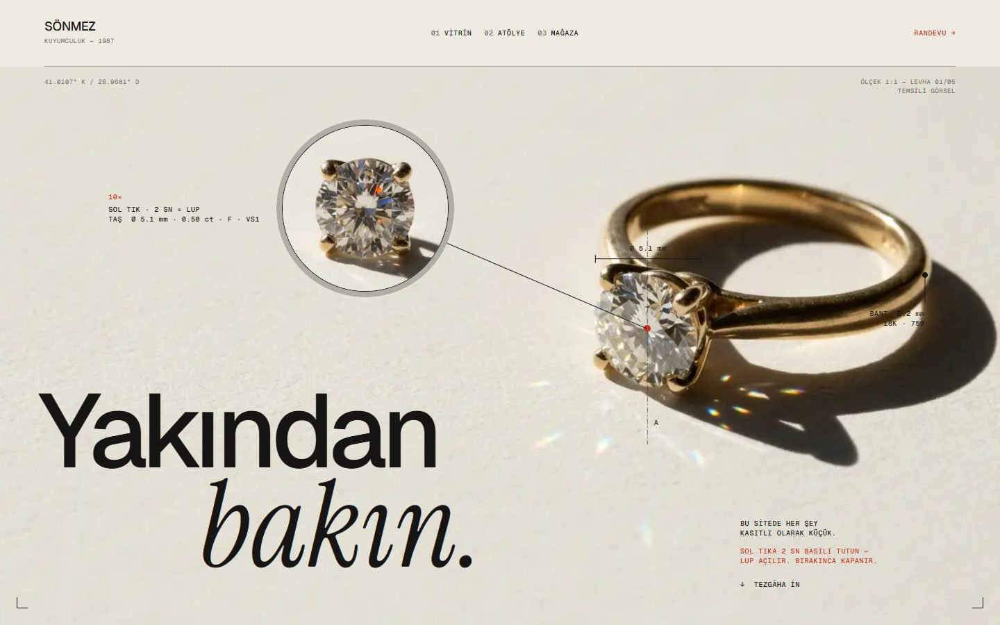
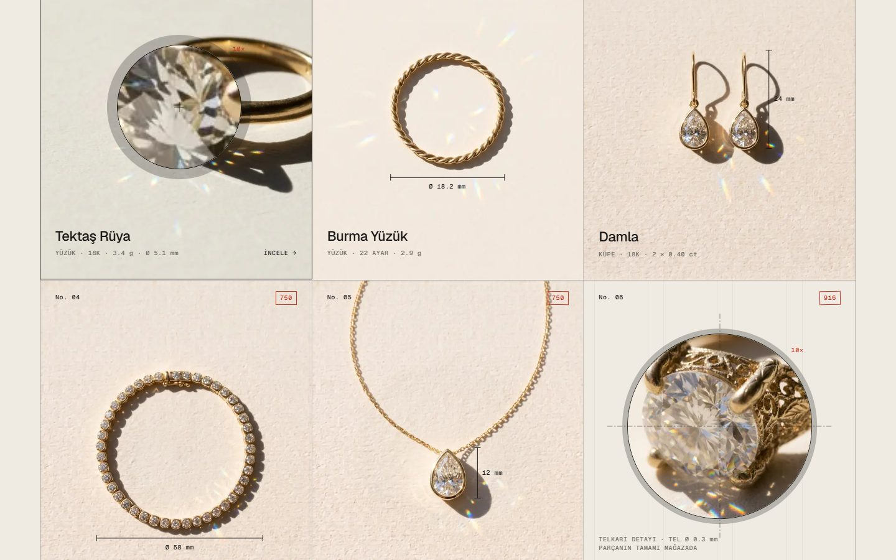
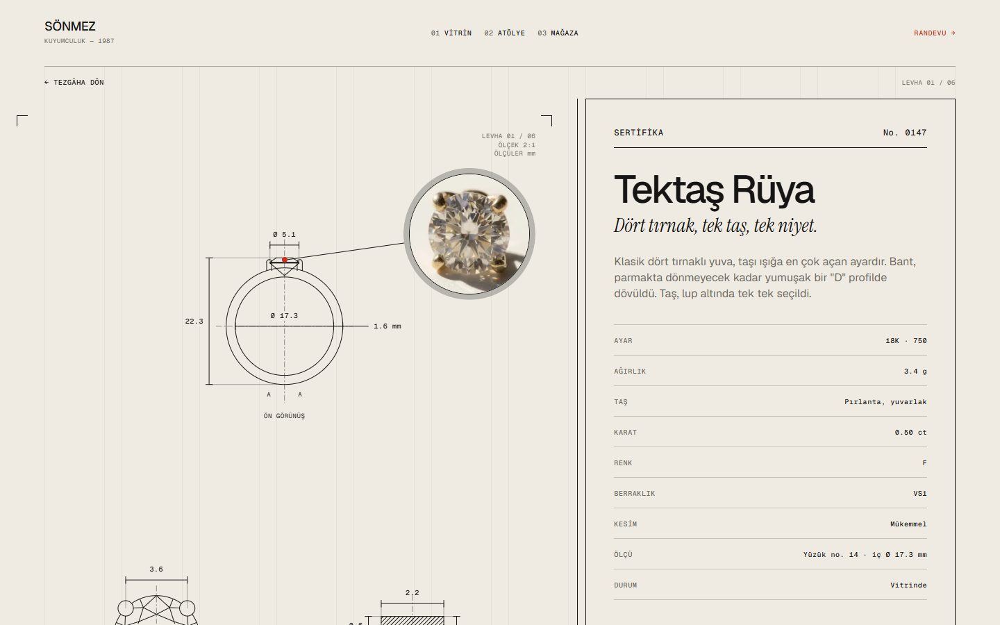

# LUP — Sönmez Kuyumculuk

**Sitede 10×. Mağazada 1:1.**

Kapalıçarşı'daki bir kuyumcu için tanıtım sitesi (pitch). Parçalar teknik çizim levhaları ve
sertifikalarla anlatılıyor, fiyat yok. Sitede her şey kasıtlı olarak küçük. Yakından bakmak için
bir lup var: fareyle sol tık 2 sn basılı tutunca, dokunmatikte bir parçaya basılı tutunca açılıyor.
Amaç ziyaretçiyi mağazaya, parçayı elde görmeye çağırmak.

| Ana sayfa | Lup (basılı tut) | Ürün levhası |
|---|---|---|
|  |  |  |

Site şu an `noindex, nofollow` (`src/content/site.ts` → `indexable: false`): kuyumcu onaylayana kadar
arama motorlarına kapalı.

## Yığın

Next.js 16 (App Router, Turbopack) · React 19.2 · TypeScript (strict) · Tailwind CSS v4 ·
GSAP 3 (ScrollTrigger, DrawSVG) · Lenis · Vitest. Paket yöneticisi pnpm.

## Kurulum

```bash
pnpm install
pnpm dev
```

`http://localhost:3000` adresinde açılır.

| Komut | Ne yapar |
|---|---|
| `pnpm dev` | Geliştirme sunucusu |
| `pnpm build` / `pnpm start` | Üretim derlemesi ve sunucusu |
| `pnpm lint` | ESLint, uyarı sınırı 0 |
| `pnpm typecheck` | Rota tipleri + `tsc --noEmit` |
| `pnpm test` | Birim testleri (Vitest) |
| `pnpm test:e2e` | Uçtan uca duman testleri (Playwright; önce `pnpm build`, yerelde `PW_CHANNEL=msedge`) |
| `pnpm format` | Prettier |

Her push (master) ve PR'da GitHub Actions aynı denetimleri çalıştırır (`.github/workflows/ci.yml`).

## Klasörler

```
src/
  app/                  rotalar: ana sayfa, /parca/[slug], 404, hata sınırı, OG görselleri, robots, sitemap
  content/              tüm metin ve veri: copy.ts (metinler), products.ts (parçalar), site.ts (adres, saat…)
  styles/tokens.css     renk, tipografi, grid token'ları (tek kaynak; TS karşılıkları lib/tokens.ts)
  components/
    layout/             Nav, mobil menü, footer, levha çerçevesi (PlateFrame)
    sections/           ana sayfa bölümleri: Hero, Vitrin, 10×, Atölye, Mağaza
    product/            teknik levha, sertifika, diğer parçalar şeridi
      drawings/         SVG teknik çizimler (ön/üst görünüş, kesit, tarama)
    primitives/         ölçü çizgisi, çağrı notu, lup dairesi, damga, başlık…
    loupe/              lup (klon, basılı tutma, aynalama)
    motion/             GSAP animasyonları; hidrasyondan sonra ayrı pakette yüklenir
  lib/                  Lenis, GSAP kurulumu, açık/kapalı hesabı, sayfa geçişi, SITE_URL…
```

Kurallar:

- Türkçe metin yalnızca `src/content/`'te, renk ve ölçü değerleri yalnızca `tokens.css` ve `lib/tokens.ts`'te.
- Şartnameden sapan her karar [`KARARLAR.md`](KARARLAR.md)'de: tarih, karar, gerekçe, geri alma.
- Aşamalar ve kabul listeleri [`ILERLEME.md`](ILERLEME.md)'de.

## Lup nasıl çalışır

- `#lup-content` (Nav, sayfa, footer) bir kez klonlanır. Klon, lupun içinde 3.3× ölçekli bir sahnede durur.
- Lup hareket ettikçe yalnızca sahnenin `transform`'u değişir. Konum GSAP ticker'ında, Lenis ile aynı saatte lerp'lenir.
- Klon fontlar ve görseller yüklendikten sonra boşta kurulur; boyut ve rota değişiminde yenilenir.
- Dokunmatik cihazda klon ilk dokunuştan sonra boşta kurulur.
- Lup ilk kez açılınca klondaki görseller yüksek çözünürlüklü, optimize kopyalarına geçer (`lib/hires.ts`).

| Durum | Fare / kalem | Dokunmatik |
|---|---|---|
| Kapalı | Normal imleç; linkler, seçim, sürükleme her zamanki gibi | — |
| Basılı tutarken | Dış halka ve 2 sn'de dolan kırmızı yay; 10px hareket, sağ tık, pencereden çıkış iptal eder | 180 ms |
| Açık | İmleç gizli, lup her yerde büyütür; `data-loupe-off` alanlarında yalnızca halka | Parmağın 60px üstünde; sayfa kaymaz |
| Bırakınca | Kapanır; izleyen tıklama yutulur (link açılmaz) | Aynı |

Klon canlı sayfayla aynı görünsün diye bazı öğeler işaretlenir (aşağıdaki sözlükte "Lup").

## `data-*` öznitelik sözlüğü

Davranış taşıyan öznitelikler. Stil kancası olanlar (`data-dim-*`, `data-callout-*` gibi bileşen içi
parçalar) bileşenlerinin içinde kalır; yeni bölüm eklerken bakılacaklar bunlar.

**Lup**

| Öznitelik | Nereye | Ne yapar |
|---|---|---|
| `data-loupe-hide` | Klonda olmaması gereken öğe (Nav, "10×" etiketleri, kullanım bilgisi, atlama linki) | Klondan silinir |
| `data-loupe-off` | Büyütülmeyecek alan (Nav, footer, mobil menü) | Basılıyken lup yalnızca dış halka |
| `data-loupe-sync` | Kaydırmaya bağlı (scrub/pin) animasyonlu öğe | Satır içi stili her karede klona aynalanır |
| `data-loupe-sticky` | `position: sticky` öğe (sertifika) | Klonda kaydırmaya göre transform ile taşınır |
| `data-loupe-scroll` | Kendi içinde kayan kap (diğer parçalar şeridi) | Yatay kaydırma klona aynalanır |
| `data-hires` | `` | Lup ilk açılınca klondaki görsel bu adrese geçer |
| `data-loupe` | Lup kökü | `data-state` (off / idle / active), `data-mode` (mouse / touch), `data-ready` (clone / ring) |

`<html>` üzerindeki durumlar: `loupe-open` sınıfı (lup açık: imleç gizli, seçim kapalı),
`data-loupe-holding` (fareyle basılı tutuluyor), `data-loupe-touch` (dokunmatik lup açık).

**Giriş animasyonu**

| Öznitelik | Ne yapar |
|---|---|
| `data-intro` | Bölge JS animasyonu kurulana kadar gizli (`html.js-anim:not(.anim-ready)`); JS 4 sn'de gelmezse gizleme kalkar, `intro-skipped` eklenir |
| `data-intro-keep` | `data-intro` içinde gizlenmeyen kısım: ilk boyamada CSS ile girer (hero fotoğrafı, başlık, not), LCP JS'i beklemez |

**Çizim ve bindirme**

| Öznitelik | Ne yapar |
|---|---|
| `data-draw="axis \| outline \| detail"` | Levha çiziminde sıra: eksenler → dış kontur → iç detay (PlateMotion) |
| `data-plate`, `data-plate-window` | Teknik levha ve mobildeki penceresi; pencereler ekrana girince çizilir |
| `data-plate-note`, `data-plate-meta`, `data-plate-guide` | Levhada son açılan notlar, antet ve lupa giden kılavuz çizgi |
| `data-dimension` (+ `data-animate`) | Ölçü çizgisi; `data-animate` ile girişte çizilir |
| `data-callout` | Nokta + çizgi + etiketli çağrı notu |
| `data-lens` | Statik lup dairesi (fotoğraf) |
| `data-photo-overlay`, `data-photo-inner`, `data-photo-frame` | Fotoğraf ve ona kilitli bindirme kutusu (object-fit: cover hesabı CSS'te) |
| `data-grid-lines` | Zemindeki sabit kolon çizgileri; klonda mutlak konuma geçer |

**Bölüm kancaları (motion/)**

`data-hero-*` (hero parçaları), `data-tray` / `data-tray-cell` (vitrin tepsisi ve hücresi),
`data-part-photo` (sayfa geçişinde yerinde kalan fotoğraf), `data-makro-*`, `data-atolye-photo`,
`data-count` (sayaç), `data-compare` / `data-compare-block` (Mağaza 10× ↔ 1:1),
`data-anim-label` (bölüm etiketi), `data-headline-mask` / `data-headline-line` (başlık maskesi),
`data-certificate` / `data-cert-row` / `data-stamp` (sertifika girişi), `data-signature`,
`data-status-dot` + `data-open` (açık/kapalı nabzı), `data-dragging` (şerit sürüklenirken, JS koyar).

Diğer: `data-lenis-prevent-horizontal` (Lenis yatay kaydırmaya karışmaz).

## Görseller

- Kaynaklar `public/images`'ta; sayfada `next/image` ile, lupta `/_next/image?…&w=1920` ile WebP/AVIF.
- Bulanık yer tutucular `src/content/blur.ts`'te. Görsel eklenir ya da değişirse:

  ```bash
  node scripts/blur.mjs
  ```

- Paylaşım görselleri (`opengraph-image.tsx`) derlemede ya da ilk istekte üretilir. Fontlar `src/assets/fonts`'ta (Geist, OFL).

## Yayın

Vercel'e:

```bash
npx vercel
```

Adres Vercel ortamından alınır. Başka bir yerde yayınlanırsa `NEXT_PUBLIC_SITE_URL` verilmeli (ör.
`https://sonmezkuyumculuk.com`). Verilmezse paylaşım etiketleri, canonical ve JSON-LD `localhost`'a düşer; derleme uyarır.

- **Kendi sunucunda (`next start`, Docker, VPS):** görsel optimizasyonu `sharp` ister.
  - `pnpm-workspace.yaml`'da `sharp`'ın kurulum betiği kapalı (`allowBuilds: sharp: false`), hazır ikili paketlerle çalışıyor.
  - Hedef platformda `/_next/image` hata verirse `sharp: true` yapıp yeniden kur.
- **Yayından önce:**
  - `src/content/site.ts`'teki telefon ve WhatsApp numarası yer tutucu; derleme uyarır.
  - Adres, saatler ve ölçüler kuyumcudan teyit edilmeli (ILERLEME, Aşama 9).
  - Site açılacaksa `site.indexable: true`: robots.txt taramaya açılır, site haritası adresi eklenir.

## Geliştirme süreci

Site bir uygulama şartnamesine göre (repoda yok) aşama aşama, yapay zekâ ajanı (Claude Code) desteğiyle
yazıldı.

- Kod yorumlarındaki `§9.2` gibi atıflar o şartnamenin bölümlerine.
- `K-…` atıfları `KARARLAR.md`'deki kararlara.
- `CLAUDE.md` / `AGENTS.md` ajan yönergeleri.
- Her aşamanın kabul listesi ve doğrulama notları `ILERLEME.md`'de.
